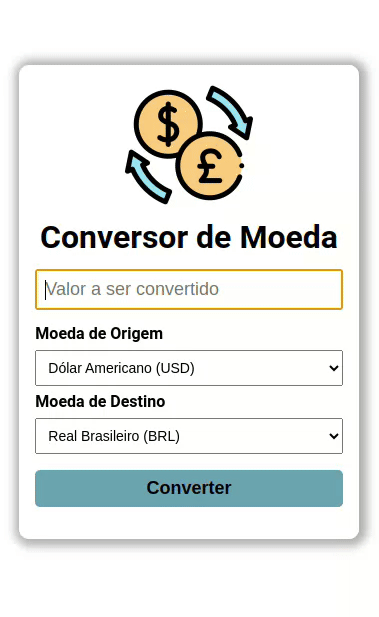

# Conversor de Moedas

Aplicação desenvolvida para resolução de um dos desafios da formação da Turma 6 da [Oracle Next Education](https://www.oracle.com/br/education/oracle-next-education/) em parceria com a [Alura](https://www.alura.com.br/)

### 1. Configuração

⚠️ Essa aplicação utiliza a ***ExchangeRate API*** para conversão das moedas, então é necessário obter uma chave da api [clicando aqui](https://app.exchangerate-api.com/), criar o arquivo *application.properties* dentro do diretório **/api/src/main/resources** e inserir o seguite conteúdo:

```
apiKey=SUA_CHAVE_DA_API
```

### 2. Iniciando a API da aplicação

- ⚠️  É necessário ter concluído o *passo 1*

- É necessário ter instalado na sua máquina alguma versão do **JDK**. Agumas opcões: [Oracle JDK](https://www.oracle.com/java/technologies/downloads/) ou [OpenJDK](https://openjdk.org/)
- Com o JDK já instalado, dentro do diretório ***/api*** execute o seguinte comando:

```
./gradlew bootRun
```

- Caso realize alguma alteração, rode a suíte de testes para verificar se a aplicação ainda está funcionando corretamente:

```
./gradlew test
```

### 3. Iniciando a aplicação

- ⚠️  É necessário ter concluído o *passo 2*
- É necessário ter instalado na sua máquina o Node(runtime javascript) e NPM(gerenciador de pacotes do node). Você pode instalá-los [clicando aqui](https://nodejs.org/).

- Com o Node e NPM já instalados, dentro do diretório ***/front-end*** execute o seguinte comando para instalar as dependências necessárias do projeto:

```
npm install
```

- E em seguida o seguinte comando para rodar o servidor da aplicação em modo de desenvolvimento:

```
npm run dev
```

- Caso deseje executar os testes de interface, execute o seguinte comando:

```
npm test
```

Caso tenta tenha sido configurado corretamente, sua aplicação estará sendo executada em http://localhost:5173

### Screenshot

<div>
    
</div>
<a href="https://www.flaticon.com/free-icons/exchange-rate" title="exchange rate icons">Exchange rate icons created by Freepik - Flaticon</a>

### Licença

```
MIT License

Copyright (c) 2024 Janssen Batista

Permission is hereby granted, free of charge, to any person obtaining a copy
of this software and associated documentation files (the "Software"), to deal
in the Software without restriction, including without limitation the rights
to use, copy, modify, merge, publish, distribute, sublicense, and/or sell
copies of the Software, and to permit persons to whom the Software is
furnished to do so, subject to the following conditions:

The above copyright notice and this permission notice shall be included in all
copies or substantial portions of the Software.

THE SOFTWARE IS PROVIDED "AS IS", WITHOUT WARRANTY OF ANY KIND, EXPRESS OR
IMPLIED, INCLUDING BUT NOT LIMITED TO THE WARRANTIES OF MERCHANTABILITY,
FITNESS FOR A PARTICULAR PURPOSE AND NONINFRINGEMENT. IN NO EVENT SHALL THE
AUTHORS OR COPYRIGHT HOLDERS BE LIABLE FOR ANY CLAIM, DAMAGES OR OTHER
LIABILITY, WHETHER IN AN ACTION OF CONTRACT, TORT OR OTHERWISE, ARISING FROM,
OUT OF OR IN CONNECTION WITH THE SOFTWARE OR THE USE OR OTHER DEALINGS IN THE
SOFTWARE.
```

